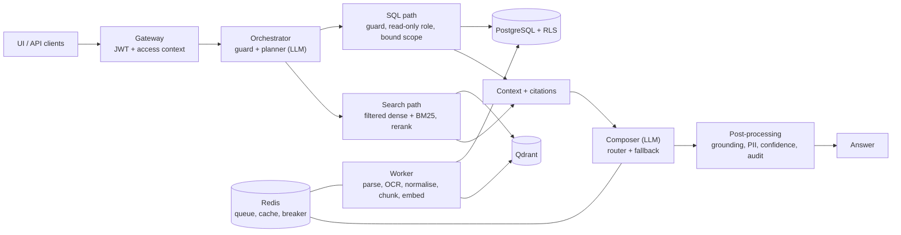

# Attendance Intelligence

A multi-tenant RAG microservice for attendance evidence. It:
- ingests attendance evidence in mixed formats (CSV, Excel, Word, text PDF and scanned PDF) and normalises it into one canonical record model;
- answers business questions **only from data the caller is allowed to see**, with citations to the exact file and row, a confidence score, and a controlled "unavailable" or "denied" answer when needed;
- exports results as JSON, Excel and PDF;
- improves through a governed feedback loop.

Built for the Vardaan Data Sciences AI engineer take-home assignment. **All data is synthetic.**

- [What it does](#what-it-does)
- [Run it: normal commands (first choice)](#run-it-normal-commands-first-choice)
- [Run it: Docker Compose (alternative)](#run-it-docker-compose-alternative)
- [Try it](#try-it)
- [API](#api)
- [Architecture](#architecture)
- [Technology choices and substitutions](#technology-choices-and-substitutions)
- [Security and governance](#security-and-governance)
- [Configuration](#configuration)
- [Tests](#tests)
- [Sample data](#sample-data)
- [Implemented, simulated and production](#implemented-simulated-and-production)
- [Known limitations](#known-limitations)
- [Project layout](#project-layout)

**More documentation:**
- [docs/architecture.md](docs/architecture.md): the reference-layer map and the isolation checkpoints;
- [docs/design.md](docs/design.md): the full design and decision log;
- [docs/test-summary.md](docs/test-summary.md): mandatory scenarios mapped to tests;
- [docs/walkthrough.md](docs/walkthrough.md): the demo script;
- [docs/openapi.json](docs/openapi.json): the API specification.

## What it does

| Requirement | How |
|---|---|
| Mixed-format ingestion | Upload through the UI or API. Parsers handle CSV, XLSX (long and matrix/muster layouts), DOCX tables and narrative, text PDF, and scanned PDF with Tesseract OCR. A worker processes each file through validate → extract → normalise → store → index, with retries. |
| Canonical model and traceability | Each record is one employee on one day: date, employee, department, status, times, hours and remarks. It carries its source file and page, row or cell, extraction method and confidence, review status and classification, plus product, tenant and module. |
| Idempotency and change detection | Files are identified by a SHA-256 checksum, so a re-upload is marked `duplicate`. A changed file becomes a new version, and only the records that changed are replaced (a record-level diff). |
| OCR you can trust | Each field gets its own confidence. Doubtful cells become `needs_review` and are **never used in answers**; answers say when records were held back. |
| Question answering | One endpoint. An LLM planner picks the mode:<ul><li>**structured (SQL)** for counts, percentages, rankings and lists;</li><li>**document** (hybrid dense + BM25 search) for reasons and notes;</li><li>**hybrid** for both.</li></ul>An LLM composer writes the answer from the retrieved context only. |
| Citations and confidence | Every answer cites files and rows ([D1]) or snippets ([S1]). Citations, numbers and names are checked against what was retrieved. A deterministic confidence score comes with reasons, and a low score gives `needs_review`. |
| Isolation | Product, tenant, entity (department or employee), module, role and classification are enforced **before retrieval**: at the gateway, in a question guard, by PostgreSQL row-level security, in three barriers around LLM-written SQL, and in the vector-search filter. The model never decides access. |
| Export | JSON, Excel and PDF, for records or for one question's answer and evidence. Exports are rebuilt under the caller's current access, identical across formats, and audited. |
| Feedback/training loop | An admin corrects an answer. The correction is validated, **replayed** against the data, and stored as a scoped, versioned example. Equivalent questions in the same scope then follow it. It can be deactivated, which rolls it back. |
| Provider fallback | Primary model, then fallback model, then a controlled error, with a circuit breaker in Redis. |
| Audit | Every question, denial, upload, export and feedback decision is recorded with the request ID, context, retrieved IDs, model, fallback path, confidence and outcome. |

## Run it: normal commands (first choice)

This is the fastest path: the app runs directly on your machine and uses PostgreSQL, Redis and Qdrant wherever you have them, whether local installs or free cloud tiers. The build was tested with Aiven PostgreSQL 17, Redis Cloud 8 and Qdrant Cloud 1.19. Commands are shown for PowerShell; on macOS or Linux use `cp` instead of `copy`.

**You need:**
- Python 3.12 and [uv](https://docs.astral.sh/uv/);
- Node.js 22.12 or later;
- PostgreSQL 16 or 17 with an admin account that can create roles and databases;
- Redis 7 or later;
- Qdrant 1.19. Without it, the service still answers structured questions but not document questions.
- Tesseract 5, only for the scanned PDF.
- An OpenRouter API key, optional. Without it, every question gets a controlled "provider unavailable" answer.

```powershell
# 1. Configure: fill in JWT_SECRET, the database URLs, REDIS_URL, QDRANT_URL/QDRANT_API_KEY,
#    OPENROUTER_API_KEY and TESSERACT_CMD (see "Configuration")
copy .env.example .env

# 2. Install the backend, and build the UI (served by the API at /ui)
uv sync
cd frontend; npm install; npm run build; cd ..

# 3. Create the database roles and the database, run the migrations and apply the grants (idempotent)
uv run python scripts/db_setup.py

# 4. Run the API and the worker, in two terminals
uv run uvicorn attendance_ai.main:create_app --factory --host 127.0.0.1 --port 8000
uv run python -m attendance_ai.worker

# 5. Load the eight sample files as the right tenant admins, and wait for processing
uv run python scripts/load_samples.py
```

Open **http://127.0.0.1:8000/ui/**. Health is at `/health/ready` and the API docs at `/docs`.

**Optional:**
- `uv run python scripts/check_llm_key.py openrouter` checks the model key with one 16-token call.
- `uv run python scripts/run_live_eval.py` asks the 20 demo questions and checks each answer against the expected results, for about 1–3 cents.
- `uv run python scripts/load_samples.py --changed-file` shows the duplicate upload and the v2 of a changed file.
- UI development with live reload: `cd frontend; npm run dev`, then open http://localhost:5173/ui/.

## Run it: Docker Compose (alternative)

The same system in containers: PostgreSQL 17, Redis 7.4, Qdrant 1.19.1, a one-shot database setup, the API (which also serves the UI) and the worker. Tesseract and the embedding models are built into the image.

```powershell
# 1. Local settings: change the passwords and JWT_SECRET; OPENROUTER_API_KEY is optional
copy .env.docker.example .env.docker

# 2. Build and start (the first build takes a few minutes)
docker compose up -d --build

# 3. Load the sample files
docker compose exec api python scripts/load_samples.py --base-url http://127.0.0.1:8000

# 4. Open http://127.0.0.1:8000/ui/  (the API listens on localhost only)

# 5. Stop (keeps the data), or remove everything including the data
docker compose down
docker compose down -v
```

The compose file never reads `.env`, which is for the normal commands; containers get their settings only from `.env.docker`. The API and the worker never receive the database admin or owner credentials; only the setup job does. The normal commands are the tested path: the test results and end-to-end runs come from them. The Docker files are provided as the alternative and were not part of those runs.

## Try it

**Demo users.** The sign-in page lists them; no passwords are needed in development.

| User | Tenant | Role | Sees |
|---|---|---|---|
| `acme.admin` (Acme Corp Administrator) | Acme Corp | admin | All of Acme, including restricted remarks. Can upload, export and review feedback. |
| `acme.eng.manager` (Rahul Sharma) | Acme Corp | manager | Engineering only; restricted remarks masked |
| `acme.employee` (Kavya Menon, E006) | Acme Corp | employee | Own records only |
| `globex.admin` (Globex Ltd Administrator) | Globex Ltd | admin | All of Globex |
| `globex.sup.manager` (Farhan Qureshi) | Globex Ltd | manager | Support only |
| `globex.employee` (Aisha Khan, E002) | Globex Ltd | employee | Own records only |

**Questions to try.** The expected results are in `sample_data/expected/`.

| As | Question | Expected |
|---|---|---|
| acme.admin | Which department had the highest attendance in August 2026? | Finance, 95.00% (structured, cited) |
| acme.admin | What was the overall attendance percentage for Acme in August 2026? | 89.85%, pooled over 399 counted days |
| acme.admin | Why was Vikram Reddy on leave on 18 August 2026? | Sick leave (medical reason visible to admin; hybrid) |
| acme.eng.manager | Why was Vikram Reddy on leave on 18 August 2026? | Leave; the reason is **[restricted]** |
| acme.eng.manager | What was the attendance percentage for Sales in August 2026? | **Denied**: outside Engineering |
| acme.admin | Who was absent on 15 Jul 2026? | **Unavailable**: no data for July |
| acme.admin | Show me the attendance of Globex Ltd employees for August 2026. | **Unavailable**: another tenant, audited as a denial |
| globex.admin | What was the attendance percentage for E001 in August 2026? | 88.10%, never Acme's 95.00% for its own E001 |
| acme.admin | What notes were recorded for the Operations team in August? | Operations notes; the injected memo is ignored |

[docs/walkthrough.md](docs/walkthrough.md) is the full demo script: ingestion, citations, unavailable, cross-tenant, export and feedback.

## API

The full specification is `docs/openapi.json`, and `/docs` when running. Every endpoint except health and the demo sign-in needs `Authorization: Bearer <token>`. Errors are RFC 9457 problem-details JSON with a `request_id`.

| Capability | Endpoint | Permission |
|---|---|---|
| Health and diagnostics | `GET /health/live`, `GET /health/ready` (service, database, queue, cache, search, vector, model provider) | none |
| Demo sign-in (development only) | `GET /api/v1/auth/dev-users`, `POST /api/v1/auth/dev-token` | none |
| Caller context | `GET /api/v1/me` | any |
| Ingest | `POST /api/v1/ingestions` (multipart `file`, optional `entity_id`): returns the job ID, status, checksum, version and duplicate reference | `ingest` (admin) |
| Processing status | `GET /api/v1/ingestions`, `GET /api/v1/ingestions/{job_id}`: stages, attempts, counts, failures, errors | `ingest` |
| Records | `GET /api/v1/records?date_from=&date_to=&entity_id=&employee_id=&status=&review_status=` | `query` |
| Query | `POST /api/v1/query` with `{"question": "...", "as_of": "2026-09-01"}` | `query` |
| Export | `POST /api/v1/exports` with `{"format": "json" \| "xlsx" \| "pdf", "records": {...}}` or `{"format": ..., "request_id": "..."}` | `export` |
| Feedback/training | `POST /api/v1/feedback`, `GET /api/v1/feedback`, `GET /api/v1/feedback/{id}`, `POST /api/v1/feedback/{id}/deactivate` | `feedback:submit` (admin) |

**Examples** (bash; in PowerShell use `curl.exe` and escape the quotes):

```bash
BASE=http://127.0.0.1:8000
TOKEN=$(curl -s -X POST $BASE/api/v1/auth/dev-token -H 'Content-Type: application/json' \
  -d '{"user_id": "acme.admin"}' | python -c "import sys, json; print(json.load(sys.stdin)['access_token'])")
AUTH="Authorization: Bearer $TOKEN"

# Ingest a file for a department, then follow the job
curl -s -X POST $BASE/api/v1/ingestions -H "$AUTH" \
  -F file=@sample_data/tenants/acme/inputs/acme_operations_weekly_report_2026-08.docx -F entity_id=OPS
curl -s $BASE/api/v1/ingestions/<job_id> -H "$AUTH"

# Ask a question
curl -s -X POST $BASE/api/v1/query -H "$AUTH" -H 'Content-Type: application/json' \
  -d '{"question": "Which department had the highest attendance in August 2026?"}'

# Export the Engineering records as Excel, and one answer (with its evidence) as PDF
curl -s -X POST $BASE/api/v1/exports -H "$AUTH" -H 'Content-Type: application/json' \
  -d '{"format": "xlsx", "records": {"entity_id": "ENG"}}' -o engineering.xlsx
curl -s -X POST $BASE/api/v1/exports -H "$AUTH" -H 'Content-Type: application/json' \
  -d '{"format": "pdf", "request_id": "<request_id from the query>"}' -o answer.pdf

# Correct an answer; the response shows active or rejected, the version, the scope and the replay evidence
curl -s -X POST $BASE/api/v1/feedback -H "$AUTH" -H 'Content-Type: application/json' -d '{
  "request_id": "<request_id>",
  "feedback": "State that the percentage is pooled over counted days, and how many.",
  "ideal_final_output": "Engineering attendance in August 2026 was 92.41%, pooled over 79 counted employee-days [D1].",
  "approval_note": "Matches the reporting standard."}'
curl -s -X POST $BASE/api/v1/feedback/<example_id>/deactivate -H "$AUTH"

# A tenant header can repeat the token's tenant but never change it: 403, and audited
curl -s $BASE/api/v1/me -H "$AUTH" -H 'X-Tenant-ID: globex'
```

**A query response** (abridged):

```json
{
  "request_id": "req_3f2a9c1e5b7d4a60",
  "outcome": "answered",
  "answer": "Finance had the highest attendance in August 2026 at 95.00% (76 of 80 counted days) [D1]. ...",
  "retrieval_mode": "structured",
  "confidence": {"score": 0.95, "band": "high", "reasons": []},
  "citations": [{"id": "D1", "kind": "records", "source_file": "acme_finance_attendance_2026-08.pdf",
                 "locations": "page 1 rows 1-30; page 2 rows 1-30; page 3 rows 1-20", "record_count": 80}],
  "computation": {"sql": "SELECT department_name, ROUND(...) AS attendance_pct ...", "row_count": 5,
                  "excluded_pending_review": 0, "result_preview": [{"department_name": "Finance", "attendance_pct": 95.0}]},
  "feedback_applied": [],
  "context": {"tenant_id": "acme", "product_id": "hrms", "module": "attendance", "role": "admin",
              "scope": "tenant", "entity_scope": [], "clearance": "restricted"},
  "versions": {"model": "openai/gpt-4o-mini", "prompts": "planner.v2, composer.v2", "data": 9, "knowledge": 0},
  "cached": false,
  "latency_ms": 5234
}
```

Every outcome is a normal 200 response: `answered`, `unavailable`, `denied`, `needs_review` or `out_of_scope`. Each one other than `answered` carries a `reason_code` (for example `no_data`, `out_of_scope_entity`, `other_tenant`, `policy_violation`, `provider_unavailable`) and a readable `message`.

## Architecture



The code is organised by the reference layers: `gateway/`, `orchestration/`, `ingestion/`, `stores/`, `retrieval/`, `generation/` and `governance/`, plus `feedback/` and `exports/`. The layer-by-layer map and the six isolation checkpoints, each with the tests that prove it, are in [docs/architecture.md](docs/architecture.md).

## Technology choices and substitutions

The assignment allows equivalent technologies if substitutions are explained. Relative to the reference architecture (Figure 1):

| Reference | This implementation | Why |
|---|---|---|
| Product MySQL DBs with read-only RAG views | **PostgreSQL 17** with a read-only view (`v_attendance`) and **row-level security** | Row-level security enforces tenant, entity and clearance isolation in the database itself, fails closed, and applies to LLM-written SQL too. |
| Utho object storage | Local file store, `var/storage/<tenant>/` | Simple for the MVP; it sits behind a small interface (`stores/file_store.py`), so it can swap for S3-compatible object storage. |
| Access metadata | Seed file `sample_data/seed/tenants.json` (tenants, departments, employees, users, roles, per-tenant rules) | A static directory is enough for two tenants. Production would sync from an identity provider or HR system. |
| RAG API gateway (API key + JWT) | **FastAPI** with JWT bearer tokens (HS256 in development; RS256/JWKS is a configuration change) and header validation | One reusable endpoint. The product and tenant always come from the token. |
| Query orchestrator | Deterministic question guard plus an **LLM planner** (structured, document, hybrid, out of scope) | Routing by intent, with access checks before any model call. |
| Qdrant vector DB | **Qdrant** (the same) | Semantic retrieval with payload filters and `is_tenant` indexing. |
| OpenSearch / BM25 | **BM25 sparse vectors in the same Qdrant collection** (FastEmbed `Qdrant/bm25`), fused with the dense results by RRF. Exact IDs and names also resolve through SQL. | The same exact-term capability without running a second search cluster. The access filter is applied once to both retrievers. |
| RAG metadata DB | PostgreSQL tables: sources, versions, jobs, records, query log, feedback, audit | One transactional store, all under row-level security. |
| Redis (cache, queue, provider health) | **Redis** with a **Dramatiq** queue, the answer cache and a circuit breaker | RQ does not run on Windows; Dramatiq does. The job state of record is kept in PostgreSQL. |
| Embedding generation | **FastEmbed** local ONNX models: `bge-small-en-v1.5` (dense), BM25 (sparse), a MiniLM cross-encoder (rerank) | No per-token cost, and document text never leaves the service for embedding. |
| Image OCR and quality scoring | **Tesseract 5**: two binarisation passes, ink analysis, per-field confidence | Free and local. Confidence drives the review status. |
| Generation: NVIDIA → Grok → OpenRouter → HF → Ollama | **OpenRouter** (`openai/gpt-4o-mini`), then a fallback model (`openai/gpt-4.1-nano`), then a controlled error, with a circuit breaker | Small, cheap models. The provider is any OpenAI-compatible endpoint, so NVIDIA NIM, Grok, Hugging Face or Ollama are a configuration change. |
| Failed-file retry queue | Dramatiq retries (3 attempts with backoff), job state in PostgreSQL, and a worker sweep that re-queues stale jobs | Survives worker and queue restarts. |
| DOCX, Excel and PPT extraction | DOCX and XLSX (plus CSV and PDF) | PPT was not among the required formats. |
| Front end (optional) | **React 19 + Vite + TypeScript**, served by the API at `/ui` | Covers upload, job status, questions with citations, records, export and feedback. |

Other choices: Python 3.12 with uv, SQLAlchemy 2, Alembic migrations, sqlglot to parse and guard SQL, Pydantic v2 models, openpyxl and reportlab for exports, pytest, ruff and strict mypy.

## Security and governance

| Control (assignment section 5) | Implementation |
|---|---|
| Authentication and request validation | <ul><li>JWT with the signature, `iss`, `aud` and `exp` checked and the algorithm pinned.</li><li>The token's tenant and product can't be changed by headers (403, audited), and the token's role must still match the directory.</li><li>Request bodies are validated without echoing their input, and a request ID is attached to every request.</li></ul> |
| Pre-retrieval access control | <ul><li>A question guard runs before any retrieval or model call.</li><li>PostgreSQL row-level security applies on every table (`FORCE`, fail-closed).</li><li>LLM-written SQL goes through three barriers: the SQL guard, a read-only query role, and the caller's scope bound as parameters.</li><li>Vector search carries a mandatory payload filter, and every hit is re-checked.</li></ul> |
| Prompt-injection resistance | <ul><li>Uploaded text that reads like instructions is quarantined and never retrieved.</li><li>Instruction-like questions are refused.</li><li>Document snippets are labelled as untrusted data in the prompt.</li><li>Feedback is scanned before use.</li></ul> |
| Grounding and hallucination control | <ul><li>Answers are written from the retrieved context only.</li><li>Every number and name is checked against it; an answer that fails twice is replaced by a deterministic template built from the data.</li><li>Missing or insufficient evidence gives `unavailable`; low confidence gives `needs_review`.</li></ul> |
| Citation validation | <ul><li>Only citation IDs that exist in the packed context survive.</li><li>Record citations come from an evidence query, never from the model.</li></ul> |
| PII and leakage control | <ul><li>Medical details, phone numbers and emails make a remark `restricted`. It is masked below restricted clearance in SQL, search, records and exports.</li><li>Contact details are masked in answers.</li><li>Names belonging to other tenants are caught.</li><li>Secrets never appear in logs.</li></ul> |
| Auditability | <ul><li>`audit_events` is append-only for the app.</li><li>`query_log` records every question: request ID, timestamp, context, mode, retrieved IDs, model, fallback path, confidence and outcome.</li><li>Questions are logged with contact details masked.</li></ul> |
| Feedback governance | <ul><li>Only reviewers can submit.</li><li>Feedback is validated as untrusted input and replayed against the data.</li><li>Examples are scoped to the original asker's access, versioned and reversible, and can never change access rules.</li></ul> |
| Provider fallback | A configurable chain, a circuit breaker, a controlled error when every provider fails, and every attempt recorded in the audit. |

## Configuration

Settings come from environment variables or `.env`. [.env.example](.env.example) lists every variable with its default. The main ones:

| Variable | Purpose |
|---|---|
| `JWT_SECRET` | Token signing key, at least 32 characters. Required. |
| `AUTH_DEV_LOGIN_ENABLED` | The demo sign-in picker. Refused when `APP_ENV=prod`. |
| `DATABASE_ADMIN_URL` | Used only by `scripts/db_setup.py`, to create the roles and the database. |
| `DATABASE_OWNER_URL` | Runs the migrations. |
| `DATABASE_URL` | The app role, used by the API and the worker. |
| `DATABASE_QUERY_URL` | The read-only role for LLM-written SQL. |
| `DB_POOL_SIZE` | Connection pool size; keep it small (2) on free tiers with 20 connections. |
| `REDIS_URL` | Queue, answer cache and circuit breaker. Use `rediss://` in production. |
| `QDRANT_URL`, `QDRANT_API_KEY` | The vector store. Leave empty to run without document search. |
| `OPENROUTER_API_KEY`, `OPENROUTER_MODEL`, `OPENROUTER_FALLBACK_MODEL` | The model chain. Set `LLM_PROVIDER=openai` to use OpenAI directly. |
| `TESSERACT_CMD` | The Tesseract executable, if it is not on the PATH. |
| `STORAGE_DIR`, `MODEL_CACHE_DIR` | Where uploads and local models are kept (default `var/`). |
| `FEEDBACK_MIN_SIMILARITY` | How close a question must be to an approved example's question (default 0.85). |
| `EXPORT_ROW_CAP` | The largest synchronous export (default 10,000 records). |

Per-tenant rules (attendance weights, late-arrival time, date format, status codes, OCR review threshold, holidays) are in the seed file.

## Tests

```powershell
uv run pytest tests/unit                  # no servers needed

$env:TEST_DATABASE_ADMIN_URL = "postgresql+psycopg://postgres:<password>@127.0.0.1:5432/postgres"
uv run pytest                             # also the integration tests: a throwaway database is created and dropped
```

The automated tests use a scripted model, so they are deterministic and free. OCR tests run when Tesseract is installed. [docs/test-summary.md](docs/test-summary.md) maps each of the 14 mandatory scenarios to its tests and to the live demo questions, and records the results of the final run. `scripts/run_live_eval.py` runs the 20 demo questions end to end with the real model.

Static checks: `uv run ruff check src tests scripts`, `uv run mypy` (strict) and `cd frontend; npm run typecheck`.

## Sample data

`sample_data/` is generated by `sample_data/generator/generate.py`. It contains:
- **Two tenants:** Acme Corp, with 5 departments and 20 employees, and Globex Ltd, with 2 departments and 10 employees.
- **Seven input files for August 2026:**
  - an Engineering biometric CSV;
  - a Sales muster matrix in XLSX;
  - an Operations weekly report in DOCX, with tables and narrative;
  - a Finance text PDF;
  - an HR register as an image-only scanned PDF, with two deliberately degraded cells;
  - the two Globex files.
- **Scenario files:** a changed v2 of the Engineering file, and a Word memo with an embedded prompt injection.
- **The canonical schema:** `schema/canonical_attendance_record.schema.json`.
- **Ground truth:** every expected record, 443 for Acme and 260 for Globex.
- **Expected results:** `expected/facts.json` and the 20 demo questions with expected outcomes (`expected/demo_questions.json`).

Details are in [sample_data/README.md](sample_data/README.md).

## Implemented, simulated and production

| Area | Implemented | Simulated or simplified for the MVP | For production |
|---|---|---|---|
| Identity | JWT validation, RBAC from roles, tenant and product binding | A demo sign-in picker, and an HS256 shared secret | An OIDC identity provider (RS256/JWKS), MFA for admins, short-lived tokens with refresh |
| Directory | Tenants, departments, employees and users from a seed file | Static; a change needs a restart | Sync from HR or the identity provider, with admin screens |
| Stores | PostgreSQL with row-level security, Qdrant, Redis; verified on managed cloud tiers | Originals on local disk | Object storage with encryption at rest, backups, TLS everywhere (`sslmode=verify-full`, `rediss://`) |
| Models | OpenRouter small models with fallback; local embeddings and rerank | Scripted model in tests | Provider contracts, spend caps and per-tenant quotas, evaluation sets per tenant |
| Ingestion | Four formats plus OCR, versioning, retries, quarantine | Synchronous-size files (20 MB limit); printed scans | Streaming for large files, handwriting-capable OCR, a manual review screen for `needs_review` records |
| Feedback | Scoped, versioned, replay-verified examples with rollback | Few-shot guidance; no fine-tuning | An approval workflow (four-eyes), example expiry, offline evaluation before activation |
| Operations | Health and readiness, structured JSON logs, request IDs, audit | Single instance | Metrics and tracing (OpenTelemetry), rate limiting, horizontal scaling of the API and worker |

## Known limitations

- **Demo sign-in only.** There is no password or identity provider flow. It must be disabled in production, and the app refuses to start with it when `APP_ENV=prod`.
- **Tenants come from the seed file.** Adding a tenant means editing the seed and restarting; there is no tenant administration UI.
- **Single-turn questions.** There is no conversation memory yet; that is planned for v2.
- **OCR reads printed scans.** Handwriting is not read reliably: such cells get low confidence and are held for review rather than used. Standalone image uploads (PNG, JPG) are not accepted, so scans must be PDFs. PPT is not supported.
- **Managed PostgreSQL without a superuser** (for example Aiven) cannot revoke `set_config` from the query role. There the SQL guard and the bound-scope parameters are the barriers. This is detected at setup, documented and tested.
- **Model-dependent answers.** Answer wording depends on the model; facts do not. Ungrounded drafts are repaired or replaced by a template, and low confidence is flagged.
- **Feedback guides wording and structure.** An example applies only to a closely equivalent question (similarity ≥ 0.85) in exactly the same scope.
- **Exports are synchronous**, up to 10,000 records.
- **Not implemented:** rate limiting, per-tenant quotas and model spend caps.
- **fastembed 0.8.1 quirk:** with internet access, loading the BM25 model contacts the Hugging Face hub. The Dockerfile adds the empty placeholder file that fastembed looks for, so that the image can load BM25 from its own cache.
- **Docker Compose** is provided as the alternative but was not part of the final end-to-end runs; the tested path is the normal commands.

## Project layout

```
src/attendance_ai/
  gateway/        auth (JWT), access-context dependency, routes (health, auth, ingestions, records, query, exports, feedback)
  orchestration/  question guard, planner, answer pipeline, API models
  ingestion/      file checks, parsers (CSV, XLSX, DOCX, PDF, OCR), normaliser, store, chunking, indexing, pipeline, queue
  retrieval/      SQL guard, SQL runner (bound scope), document search, context packing
  generation/     model router and circuit breaker, OpenAI-compatible provider, composer, versioned prompts
  governance/     audit, grounding, confidence, PII, injection detection
  feedback/       example store, validation and replay, service
  exports/        datasets under current access, JSON/XLSX/PDF renderers
  stores/         PostgreSQL (engine, models, setup), Qdrant, embeddings, Redis cache and queue, file store, versions
  core/           settings, access context, directory, errors, logging
  main.py         FastAPI app factory       worker.py   ingestion worker
migrations/       Alembic (row-level security policies, v_attendance)
frontend/         React UI (built to frontend/dist, served at /ui)
scripts/          db_setup, load_samples, run_live_eval, check_llm_key, export_openapi, package_submission
tests/            unit/ (no servers), integration/ (throwaway PostgreSQL)
sample_data/      seed, inputs, scenarios, ground truth, expected results, schema, generator
docs/             architecture, design, test summary, walkthrough, openapi.json
Dockerfile, docker-compose.yml, .env.example, .env.docker.example
```
