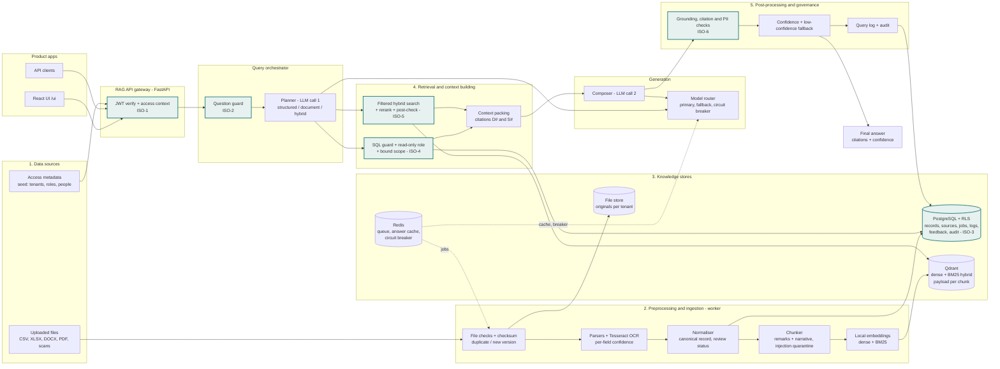
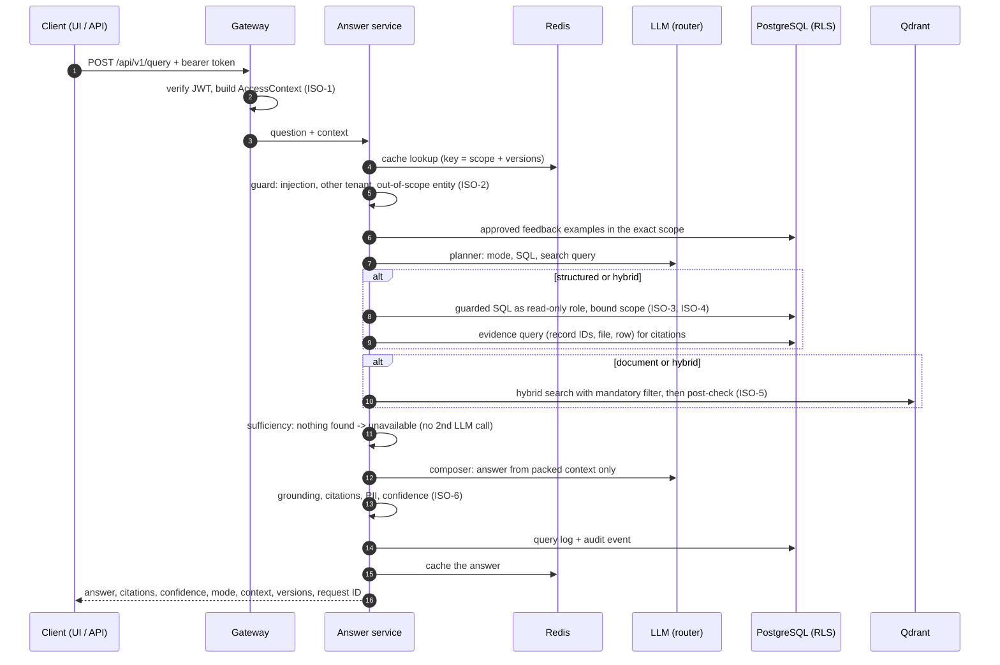

# Architecture

This page maps the implementation to the reference architecture in the assignment (Figure 1), and shows where isolation is enforced. It covers five layers plus the gateway, orchestrator and generation. The detailed design, including the data model, rules and decision log, is in [design.md](design.md).

> **Design rule:** the model never decides access. Every filter is applied before anything reaches the model, and every answer is checked against what was actually retrieved.

## 1. Component map

Highlighted boxes are isolation checkpoints. They are described in section 3.

## 2. Reference layers and the code

| Reference layer | Responsibility in the assignment | Implementation |
|---|---|---|
| **Product apps** | A single, reusable endpoint | One REST API (`/api/v1/...`). The React UI in `frontend/` is one client of it. |
| **RAG API gateway** | Validate API key/JWT, product, tenant and request context | `gateway/auth.py`: JWT, with iss/aud/exp checked and the algorithm pinned. `gateway/deps.py`: builds the access context from the token and the directory. The tenant and product come only from the token; a header that disagrees is refused (403) and audited. A request ID is attached to every request. |
| **Query orchestration** | Classify as SQL, document or hybrid, and route | `orchestration/guard.py` checks before any retrieval or model call. `orchestration/planner.py` is LLM call 1 and returns the mode, the SQL and a search query. `orchestration/answer.py` runs the pipeline. |
| **1. Data sources** | Files, access metadata | Uploaded CSV, XLSX, DOCX, text PDF and scanned PDF (`ingestion/file_checks.py`). Access metadata comes from `sample_data/seed/tenants.json` (`core/directory.py`). |
| **2. Preprocessing and ingestion** | Validation, checksum, change detection, extraction, OCR, cleaning, chunking, tagging, embeddings, retries | <ul><li>`ingestion/service.py`: SHA-256 checksum; duplicate detection; versioning by logical file name.</li><li>`ingestion/parsers/`: CSV, XLSX long and matrix, DOCX, PDF text; `ocr.py` is Tesseract with per-field confidence.</li><li>`ingestion/normalize.py`: canonical record; review status; validation flags.</li><li>`ingestion/store.py`: record-level diff (created, updated, unchanged, removed).</li><li>`ingestion/chunking.py`: remarks and narrative, isolation payload, injection quarantine.</li><li>`ingestion/indexing.py`: local embeddings, Qdrant upsert, stale-chunk cleanup.</li><li>`ingestion/pipeline.py`: stages, retries with backoff, failure capture.</li></ul> |
| **3. Knowledge stores** | Metadata DB, vector index, exact/keyword search, cache/queue/provider health | <ul><li>PostgreSQL with row-level security (`migrations/`, `stores/db.py`, `stores/models.py`).</li><li>Qdrant with dense and sparse BM25 vectors in one collection (`stores/vector_store.py`).</li><li>Redis: Dramatiq queue (`ingestion/queue.py`), answer cache (`stores/cache.py`), circuit breaker (`generation/router.py`).</li><li>File store (`stores/file_store.py`).</li></ul> |
| **4. Retrieval and context building** | Rewrite, access filters, SQL, vector and BM25 retrieval, thresholds, dedup, sufficiency, rerank, packing | <ul><li>The planner rewrites the question with explicit dates.</li><li>`retrieval/sql_guard.py` and `retrieval/sql_runner.py`: guarded SQL on `v_attendance`, plus an evidence query for citations.</li><li>`retrieval/documents.py`: dense + BM25 with RRF fusion, cross-encoder rerank and a score threshold.</li><li>Sufficiency: an empty result means `unavailable`, with no second LLM call.</li><li>`retrieval/context.py`: context packing with D# and S# citations.</li></ul> |
| **Generation** | Configurable provider or router; approved context only | <ul><li>`generation/router.py`: primary model, then fallback model, then a controlled error; a circuit breaker in Redis.</li><li>`generation/openai_compatible.py`: any OpenAI-compatible endpoint (OpenRouter by default).</li><li>`generation/composer.py`: LLM call 2.</li><li>Versioned prompts in `generation/prompts/`.</li></ul> |
| **5. Post-processing and governance** | Citations and schema, grounding, unsupported claims, PII, injection and leakage, confidence, fallback, audit | <ul><li>`governance/grounding.py`: citations must exist; numbers and names must be in the retrieved data; contact details masked.</li><li>`governance/confidence.py`: a deterministic score with reasons; a low score gives `needs_review`.</li><li>`governance/injection.py` and `governance/pii.py`.</li><li>`governance/audit.py`, plus the `query_log` table.</li><li>A template answer is used when the draft can't be verified.</li></ul> |
| **Feedback/training** (section 4.3) | Scoped, versioned, reversible supervised improvement | `feedback/`: example store, validation and replay; activate and deactivate bump the knowledge version (section 9 of the design). |
| **Export** (section 4.4) | JSON, XLSX and PDF under the same access | `exports/`: one dataset under current access, three renderers, audited (section 10 of the design). |

## 3. Where isolation is enforced

The mandatory context is `product_id`, `tenant_id`, `entity_id`, `module`, role and data classification. It travels as one immutable `AccessContext` (`core/access.py`), built once per request and passed to every store call.

| # | Checkpoint | What is enforced | Proven by |
|---|---|---|---|
| ISO-1 | **Gateway** (`gateway/deps.py`) | Valid signed token. Tenant and product come from the token only; `X-Tenant-ID` and `X-Product-ID` may repeat them, never change them. The token's role must still match the directory. Scope and clearance come from the role. | `test_auth.py`: `test_tenant_header_cannot_override_token`, `test_stale_role_in_token_is_rejected`, `test_token_for_other_tenant_user_is_rejected` |
| ISO-2 | **Question guard** (`orchestration/guard.py`), before retrieval and before any model call | Instruction-like questions are `denied`. A question naming another tenant is `unavailable`, which confirms nothing. A department or employee outside the caller's scope is `denied`. | `test_orchestration.py`: the guard tests; `test_answer_service.py`: `test_out_of_scope_questions_are_denied_before_any_model_call` |
| ISO-3 | **PostgreSQL row-level security** on every table (`migrations/versions/0001…`) | `FORCE ROW LEVEL SECURITY`. Policies read transaction-local settings for tenant, product, module, scope, entities, employee and clearance, and fail closed when the settings are missing. The app never connects as the owner. | `test_row_level_security.py` (all seven tests), `test_audit_log.py` |
| ISO-4 | **LLM-written SQL**, three independent barriers (`retrieval/`) | (1) The sqlglot guard allows one SELECT on `v_attendance` with an allow-list of functions. (2) It runs as a read-only role that can read only the view, under row-level security, with a 3 s timeout and a row cap. (3) A CTE shadows `v_attendance` with the caller's scope bound as parameters, so even changed session settings cannot widen access. | `test_retrieval.py`, `test_query_view.py`, `test_answer_service.py`: `test_bound_scope_holds_even_if_session_settings_change`, `test_unsafe_sql_is_rejected_and_repaired` |
| ISO-5 | **Vector search** (`stores/vector_store.py`) | Every search carries a mandatory filter: tenant, product and module, not quarantined, clearance at or below the caller's, and the department or own employee for narrower scopes. Every hit is re-checked, and one mismatch fails the whole request. | `test_vector_store.py` (all seven tests) |
| ISO-6 | **Post-processing** (`governance/`) | Numbers, names and citations must come from the retrieved context. Names from other tenants are caught. Contact details are masked. Restricted remarks stay masked below restricted clearance. | `test_governance.py`, `test_answer_service.py`: `test_ungrounded_drafts_are_repaired_or_replaced`, `test_restricted_remarks_stay_masked_for_managers` |
| — | **Exports** (`exports/`) | The dataset is rebuilt under the caller's current access (row-level security plus masking), never inherited from the original question. | `test_exports.py` |
| — | **Feedback** (`feedback/`) | Only reviewers may submit. Row-level security hides other tenants' questions. An example applies only in the exact scope it was approved for. The feedback text is validated as untrusted input. | `test_feedback.py`, `test_feedback_rules.py` |
| — | **Cache** (`stores/cache.py`) | The key includes the full access scope and the data, knowledge, prompt and model versions, so a cached answer is never served across scopes. | `test_orchestration.py`: `test_cache_keys_never_mix_access_scopes` |

## 4. A question, step by step

## 5. Runtime topology

| Process | Command | Talks to |
|---|---|---|
| API (serves the UI at `/ui`) | `uvicorn attendance_ai.main:create_app --factory` | PostgreSQL (app role and query role), Redis, Qdrant, LLM provider, file store (write) |
| Worker | `python -m attendance_ai.worker` | PostgreSQL (app role), Redis (queue), Qdrant, file store (read), Tesseract |
| One-off setup | `python scripts/db_setup.py` | PostgreSQL (admin, then owner): roles, database, migrations, grants |

Everything runs as three processes on one machine, either with the normal commands or with `docker compose` (see the README).
