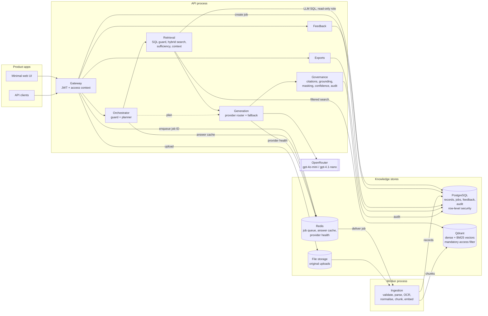

# Attendance Intelligence Microservice: Design (v1)

> **Status:** agreed MVP design, 27 September 2026.
> **Source specification:** `doc/AI Assignment Document.docx`.
> This document is the reference for implementation, and the README will be derived from it.

## 1. What we are building

A multi-tenant retrieval-augmented generation (RAG) microservice that:

1. **Ingests** attendance evidence in five formats: CSV, XLSX, DOCX, text PDF and scanned PDF.
2. **Normalises** it into one canonical attendance record, linked back to its source row or page.
3. **Answers** natural-language questions using only the data the caller is allowed to see, with citations and a confidence score.
4. **Refuses cleanly**: it returns a controlled "unavailable" or "denied" response instead of guessing.
5. **Learns from reviewers**: approved feedback improves later answers within the same tenant and scope.
6. **Exports** records and answers as JSON, XLSX and PDF.

### Principles

- **The model never decides access.** Access is enforced in the database and the vector store before anything reaches the LLM.
- **Numbers come from the database, never from the LLM.** The LLM plans queries and writes sentences; code computes and checks the results.
- **Missing is not absent, and uncertain is not fact.** A missing record means "unknown", never "absent". An uncertain value is never presented as a fact.
- **Simple MVP, production-grade core.** Isolation, grounding, audit, idempotency and tests are real. External integrations are simulated behind clear boundaries.
- **Cheap by default.** Development uses small models, and tests use a mock LLM. Each question sends the model only the few rows or snippets it needs.

### Scope

| In v1 | Deferred |
|---|---|
| 2 tenants, 1 product (`hrms`), 1 module (`attendance`) | Tenant management API |
| CSV, XLSX, DOCX, text PDF, scanned PDF (OCR) | Handwriting, standalone images, PPT |
| Single-turn questions | Conversations (v2) |
| Roles: admin, manager, employee | Feedback approval workflow, API keys per product, rate limiting |
| Local servers; Docker Compose added at the end | Cloud deployment |

## 2. Tenancy and access model

### Tenants and entities

- Tenants come from a seed file (`sample_data/seed/tenants.json`) loaded at startup.
  - The seed holds departments, the employee directory, demo users and tenant settings: timezone, date format, status codes, attendance formula and OCR threshold.
  - It stands in for the reference diagram's "Access Metadata" and "Product DB" sources.
  - It is held in memory and read-only. v1 has no database tables for tenants, departments, employees or users.
- The hierarchy is tenant → department → employee. A record's `entity_id` is its department.
- All tenants share one database and one vector collection. Every row and every vector carries `tenant_id`, `product_id`, `module`, `entity_id` and `classification`.

### Roles

| Role | Data scope | Clearance | Permissions |
|---|---|---|---|
| admin | whole tenant | restricted | ingest, query, export, feedback, audit |
| manager | own department(s) | confidential | query, export |
| employee | own records | confidential | query, export |

Access is derived from the role's scope:

- **tenant:** everything in the tenant.
- **department:** the user's `entity_scope`.
- **self:** the user's `employee_id`.

The seed's `entity_scope` list is only used for managers.

### Classification

- Levels, lowest to highest: public, internal, confidential, restricted.
- Attendance records are `confidential`.
- Remarks containing medical details, phone numbers or emails are `restricted`. Anyone below admin sees `[restricted]` instead.

### Denied vs unavailable

| Situation | Response |
|---|---|
| The request names a tenant or product other than the one in the token | `403` denied |
| The question names a department or employee outside the user's scope, in the same tenant | `denied`, before any retrieval |
| The question asks about another tenant's data | `unavailable`. A question naming another tenant is stopped by the guard before the LLM; it gets a generic no-data message and is audited as a denial. Only the caller's tenant is ever searched, so nothing reveals that the other data exists. |
| No data for the requested date or period, or evidence below the threshold | `unavailable` |
| Evidence exists but is uncertain or pending review | `needs_review` |
| Not an attendance question | `out_of_scope` |

## 3. Architecture



### Reference layers → code → runtime

| Reference layer | Package | Runs in |
|---|---|---|
| Product apps | minimal web UI, API clients | browser / client |
| RAG API gateway | `gateway/` | API process |
| Query orchestrator | `orchestration/` | API process |
| Preprocessing and ingestion | `ingestion/` | worker process |
| Knowledge stores | `stores/` | PostgreSQL, Qdrant, local files |
| Retrieval and context builder | `retrieval/` | API process |
| Generation | `generation/` | API process → OpenRouter |
| Post-processing and governance | `governance/` | API and worker processes |
| Not in the diagram: feedback, export | `feedback/`, `exports/` | API process |

### Differences from the reference diagram

| Diagram | This design | Why |
|---|---|---|
| Qdrant | Qdrant | Same. |
| OpenSearch / BM25 | BM25 sparse vectors in Qdrant, fused with dense results in one query | One search engine and one isolation filter. |
| RAG metadata DB | PostgreSQL 16 | It also holds the canonical records that LLM-written SQL runs on, under row-level security. |
| Redis (cache, queue, provider health) | Redis: job queue (via Dramatiq), answer cache, provider health | Same responsibilities as the diagram. Dramatiq rather than RQ, because its worker also runs natively on Windows. |
| Product MySQL views | Seed file | A synthetic employee directory is enough for the MVP. |
| Utho object storage | Local folder behind a storage interface | Switching to S3-compatible storage later is a configuration change. |
| NVIDIA → Grok → OpenRouter → HF → Ollama | Configurable chain: OpenRouter with small models | One OpenAI-compatible client covers all of these providers. |

## 4. Technology

| Concern | Choice | Notes |
|---|---|---|
| Language, API | Python 3.12, FastAPI, Pydantic v2 | The OpenAPI spec is generated from the code. |
| Relational store | PostgreSQL 16 | Row-level security enforces isolation, including through the view that LLM-written SQL reads. |
| Database access | SQLAlchemy 2 (sync), psycopg 3, Alembic | The API and the worker share one code path. |
| Queue, cache, provider health | Redis, with Dramatiq for background jobs | Dramatiq's worker runs natively on Windows and in Docker. |
| Vector and keyword store | Qdrant (local binary now, Docker image later), `qdrant-client` | A named dense vector plus a sparse BM25 vector. |
| Embeddings, reranking | FastEmbed (ONNX, runs on CPU): `BAAI/bge-small-en-v1.5` (384 dimensions), `Qdrant/bm25`, `Xenova/ms-marco-MiniLM-L-6-v2` | Local, so no API cost. |
| LLM | OpenRouter via the `openai` SDK: `openai/gpt-4o-mini`, falling back to `openai/gpt-4.1-nano` | Tests use a mock provider. |
| SQL checks | sqlglot | Parses LLM-written SQL before it runs. |
| Parsing | csv (standard library), openpyxl, python-docx, pdfplumber | All permissively licensed. |
| OCR | pypdfium2 to render pages, Tesseract (via pytesseract) to read them | Gives a confidence score per word. |
| Auth | PyJWT (HS256 in development) | Production would use an external identity provider (RS256 / JWKS). |
| Exports | openpyxl, reportlab | |
| UI | React + TypeScript (Vite), in `frontend/` | Built to static files that the API serves at `/ui/`; the dev server proxies API calls. No UI libraries. |
| Tooling | uv, ruff, mypy, pytest; npm for the UI | Docker Compose is provided as the one-command alternative. |

## 5. Data model

### Canonical attendance record

| Field | Type | Notes |
|---|---|---|
| `record_id` | uuid | One per stored version of a record. |
| `record_key` | text | Logical identity: the first 16 hex characters of a SHA-256 over tenant, product, module, employee ID and date. Matches the ground truth. |
| `tenant_id`, `product_id`, `module` | text | Isolation context. |
| `entity_id`, `department` | text | Department code and name. |
| `classification` | text | `confidential` by default. |
| `employee_id`, `employee_name` | text | Resolved against the tenant's directory. |
| `attendance_date` | date | |
| `status` | enum | PRESENT, ABSENT, LEAVE, WFH, HALF_DAY, HOLIDAY, WEEKLY_OFF |
| `raw_status` | text | Exactly as written in the source. |
| `check_in`, `check_out` | time | Nullable. |
| `total_hours` | numeric(5,2) | Derived when both times exist, and checked against them. |
| `remarks`, `remarks_sensitivity`, `pii_types` | text, text, text[] | Sensitivity drives masking. |
| `source_id`, `source_version_id`, `source_file` | uuid, uuid, text | Provenance. |
| `source_locator`, `source_page_or_row` | jsonb, text | For example `{"type":"row","row":14}` and "row 14". |
| `extraction_method` | enum | native_csv, native_xlsx, native_docx, pdf_text, ocr |
| `extraction_confidence`, `field_confidence` | numeric, jsonb | 1.0 for native formats; per field for OCR. |
| `review_status` | enum | auto_accepted, needs_review, verified, rejected |
| `validation_flags` | text[] | For example `hours_mismatch`. |
| `is_active`, `superseded_by` | bool, uuid | Versioning. |
| `created_at` | timestamptz | |

How each format points back to its source:

| Format | Locator |
|---|---|
| CSV | Physical line number (the header is line 1) |
| XLSX | Sheet name and cell |
| DOCX | Table number and row |
| PDF | Page number and data row (the header row is not counted) |

### PostgreSQL tables

| Table | Purpose |
|---|---|
| `sources` | One row per logical file: tenant, product, module, entity, filename, current version. |
| `source_versions` | Each uploaded version: checksum, storage path, media type, size. |
| `ingestion_jobs` | Status of each job: stage states, attempts, counts, row failures, last error. Redis only carries job IDs. |
| `attendance_records` | Canonical records, all versions. Only rows with `is_active` set can be queried. |
| `query_log` | Each question: plan, SQL, retrieved IDs, answer, confidence, outcome, versions. |
| `feedback_examples` | Approved corrections, with scope, embedding, status and version. |
| `scope_versions` | Per tenant, product and module: a data version (bumped by ingestion) and a knowledge version (bumped by feedback). |
| `audit_events` | Append-only audit trail. |

**The `v_attendance` view** is the only relation LLM-written SQL may read.

- **Columns:** `attendance_date`, `employee_id`, `employee_name`, `department_id`, `department_name`, `status`, `check_in`, `check_out`, `total_hours`, `is_late`, `attendance_weight`, `is_counted`, `remarks` (masked), `source_file`, `source_page_or_row`, `record_id`.
- **Excluded rows:** inactive, rejected and needs-review records.
- **Security:** the view is owned by the table owner and marked `security_barrier`. Tables use `FORCE ROW LEVEL SECURITY`, so the policies still apply through the view, using the caller's session settings. The query role can read the view but not the table beneath it, so it cannot get around the view's masking.

### Qdrant collection: `attendance_chunks`

- **One collection for all tenants.** The `tenant_id` payload index is marked as the tenant key.
- **Vectors:** `dense` (384 dimensions, cosine) and `bm25` (sparse, with the IDF modifier).
- **Payload:**
  - isolation fields: `tenant_id`, `product_id`, `module`, `entity_id`, `employee_id` (remark chunks only), `classification`;
  - content: `chunk_type` (`narrative` or `remark`), `text`, `attendance_date`;
  - provenance: `source_id`, `source_version_id`, `source_file`, `locator`;
  - `quarantined`.
- **Point ID:** a UUIDv5 of `source_version_id:chunk_no`, so re-indexing the same content is idempotent.
- **What gets chunked:**
  - narrative paragraphs from DOCX and PDF, split at headings into chunks of roughly 150–300 words;
  - each record's remark, with the employee, date and department included in the text.
- **Record rows are not chunked.** The SQL path answers questions about them.

### Identity, idempotency and versioning

- **Duplicate files.** Each file gets a SHA-256 checksum, scoped to tenant, product and module. Uploading a file with the same checksum returns the existing job, and nothing is reprocessed.
- **New versions.** A logical source is identified by tenant, product, module and filename. The same name with a new checksum creates a new version:
  1. In one transaction, the new records become active and the previous version's records are marked superseded.
  2. The new vectors are indexed.
  3. Only then are the previous version's vectors deleted.
- **One active record per day.** Each record has a logical `record_key` and one stored row per version. A partial unique index allows only one active record per tenant, product, module, employee and date.
- **Cross-source collisions.** A row that collides with an active record from a different source is rejected and reported. v1 does not resolve conflicts between sources.

## 6. Ingestion

**Job states:** `queued` → `running` → `completed`, `completed_with_errors`, `failed` (after 3 attempts) or `duplicate`.

| Stage | What happens |
|---|---|
| receive (API) | Check the caller is admin. Enforce the size limit (20 MB), detect the type from content, guard against zip bombs (XLSX and DOCX are zip files), compute the checksum, save the file and create the job. |
| extract | A parser for each format produces rows (values, locator, confidence, raw text) and blocks of text. |
| normalise | Map header synonyms to canonical fields and status codes to the enum (using the tenant's map). Parse dates in the tenant's format, and times. Compute total hours. Resolve names and IDs against the directory. |
| validate | Check required fields, known employee, valid date, check-out after check-in, hours consistency and duplicates within the file. Failing rows are reported and the good rows continue. |
| store | Upsert records and supersede the previous version, in one transaction. |
| index | Chunk narratives and remarks, run injection and PII detection, create dense and sparse embeddings, upsert to Qdrant, and delete superseded vectors. |

### Worker

- The API commits the job row in PostgreSQL, then enqueues the job ID on Redis through Dramatiq. PostgreSQL stays the source of truth for status.
- The worker is a separate process (`python -m attendance_ai.worker`). It sets the job's tenant context, then runs the stages under row-level security.
- Dramatiq retries a failed job with exponential backoff, up to 3 attempts. After that the message goes to Dramatiq's dead-letter queue, the job is marked `failed`, and it stays visible in the status endpoint.
- A periodic sweep re-enqueues jobs left `queued`, for example if enqueueing failed after the commit.
- **Inline mode** (`INGESTION_MODE=inline`, used by the Vercel deployment, which cannot run a worker): the upload request runs the same pipeline itself through `ingestion/inline.py`. Temporary failures are retried there after a short pause, up to 3 attempts. With no sweep, a job still `queued` or `running` after 10 minutes lost its request and is shown as `failed`. In either mode, uploading a file whose processing failed processes the same version again instead of being reported as a duplicate.

### Parsers

| Format | Approach |
|---|---|
| CSV | Standard-library `csv`, encoding detection, header mapping. |
| XLSX | openpyxl. Finds the header row and detects the matrix layout (date headers give one record per cell). Title and legend sheets are ignored. |
| DOCX | python-docx tables for records; paragraphs become narrative text. |
| PDF, text | pdfplumber tables, with header and footer lines removed. |
| PDF, scanned | Pages without a text layer are rendered at 300 DPI (pypdfium2) and read by Tesseract. Words are grouped into rows and columns by position, and each cell gets a confidence score. |

### OCR review

- A record is marked `needs_review` if any key field (date, employee, status, times) scores below the tenant's threshold (0.80).
- Records needing review are left out of calculations. Answers count and disclose them.

### Security at ingestion

- **Uploaded content is treated as data, never as instructions.**
- **Injection scanning.** Text is scanned for instruction-like patterns such as "ignore previous instructions", "you are now" or "system prompt". Flagged chunks are quarantined, so they are never used as answer context, and a security event is written to the audit log.
- **Sensitivity tagging.** Remarks containing medical terms, phone numbers or emails are tagged `restricted`.

## 7. Answering a question

Every step is code except the two marked **LLM**.

1. **Gateway.** Verify the JWT, then build the `AccessContext` from the token and the seed.
2. **Cache (Redis).** If the same question was already answered for the same access scope, data version and knowledge version, return that answer.
3. **Guard.**
   - Questions that look like instructions to the system are refused as `denied` and audited.
   - A question naming another tenant (by ID or name) returns `unavailable` with reason `other_tenant`. The message is the same kind of no-data message as any other, so it confirms nothing.
   - Departments and employees named in the question are matched against the tenant directory. If any is outside the user's scope, the answer is `denied`.
4. **Planner (LLM).**
   - **Input:** the question, a reference date and timezone, a description of `v_attendance`, the user's scope described in words, and up to 2 approved feedback examples.
   - **Output (JSON):** `mode` (structured, document, hybrid or out_of_scope), `sql`, `search_query` and `rewritten_question`.
5. **Retrieval.**
   - **SQL path.** Three independent barriers, then provenance:
     - The query must pass the SQL guard.
     - It runs as the read-only role, in a read-only transaction with the caller's access settings (row-level security), a 3-second timeout and a 200-row cap.
     - The query's `v_attendance` resolves to a CTE that filters the real view by the caller's scope, bound as parameters, and re-applies masking. Even if the session settings were changed mid-query, the bound filters would still hold. This matters on managed PostgreSQL, where `set_config` cannot be revoked from the query role.
     - A second query, generated by code from the model's WHERE clause, collects the records that fed the calculation, so they can be cited.
     - If the guard or the database rejects the SQL, the planner gets one chance to repair it.
   - **Search path.**
     - A Qdrant query with the mandatory access filter runs dense and BM25 searches (20 results each).
     - The two lists are merged with reciprocal rank fusion, reranked by the cross-encoder, and cut to the top 5 above a score threshold.
     - Every returned point is re-checked against the access context. Any mismatch fails the whole request.
6. **Sufficiency.** An empty SQL result, or no chunk above the threshold, returns `unavailable` without a second LLM call.
7. **Composer (LLM).**
   - **Input:** only the packed context: the SQL result table plus numbered snippets `[S1]`, `[S2]` and so on.
   - **Output (JSON):** `answer`, `citations` and `insufficient`.
8. **Validator.**
   - The output matches the schema.
   - Citations are a subset of the IDs that were provided.
   - Every number in the answer appears in the SQL result or in a cited snippet.
   - Every employee name or ID appears in the context.
   - A masking pass runs, and confidence is calculated.
   - An invalid answer gets one repair retry, then the fallback.
9. **Finish.** Respond, write to `query_log` and `audit_events`, and store the answer in the cache.

### SQL guard (sqlglot, PostgreSQL dialect)

- **Statement shape:** exactly one `SELECT` statement. CTEs are allowed; `INTO` and locking clauses are not.
- **Tables:** the only relation allowed is `v_attendance`. No schema-qualified names and no system catalogs.
- **Functions:** only those on an allow-list (aggregates, rounding, date and string helpers). This blocks `set_config`, which could otherwise switch the tenant mid-query, along with `current_setting`, `pg_sleep` and similar.
- **Row cap:** always enforced.

### Citations

- **Calculated answers** cite the records that fed the calculation, grouped by file with row or page ranges and counts. The full list is available through export.
- **Evidence answers** cite the chunks they used.

### Confidence (deterministic, 0 to 1)

- **Structured answers** start at 1.0, then subtract:
  - coverage gaps: the share of expected working days with no record, × 0.5;
  - OCR uncertainty: the share of records that came from OCR, weighted by (1 − OCR confidence);
  - 0.1 if records pending review were excluded;
  - 0.05 if a fallback model wrote the answer.
- **Document answers:** the top rerank score scaled to 0–1, averaged with the share of answer sentences that carry citations.
- **Bands:**
  - high: 0.80 and above;
  - medium: 0.50 to 0.79;
  - low: below 0.50. A low answer becomes `needs_review`, with the reasons listed.
- The weights are configuration, not code.

### Provider fallback

- The chain is: primary `openai/gpt-4o-mini`, then fallback `openai/gpt-4.1-nano`, then a controlled error.
- If every model fails:
  - structured questions return `503`;
  - document questions return the evidence without a written answer.
- A circuit breaker skips a failing model for 60 seconds. Its state is kept in Redis, so every API process shares it.
- Every attempt is audited.

### Response shape

```json
{
  "request_id": "req_7f3c9a1e",
  "outcome": "answered",
  "answer": "Engineering's attendance in August 2026 was 92.41% (73 attended of 79 counted days).",
  "retrieval_mode": "structured",
  "confidence": {"score": 0.97, "band": "high", "reasons": []},
  "citations": [
    {"id": "S1", "source_file": "acme_engineering_biometric_2026-08.csv", "locations": "rows 2-80", "records": 79}
  ],
  "computation": {
    "formula": "sum of weights / counted days x 100; Present and WFH = 1, Half day = 0.5, Absent and Leave = 0; holidays and weekly offs excluded",
    "filters": {"department": "ENG", "from": "2026-08-01", "to": "2026-08-31"},
    "coverage": "79 of 80 expected records (E003 has no record on 2026-08-20)",
    "excluded_pending_review": 0
  },
  "context": {"tenant_id": "acme", "product_id": "hrms", "module": "attendance", "role": "admin", "scope": "tenant", "clearance": "restricted"},
  "applied_feedback": [],
  "versions": {"model": "openai/gpt-4o-mini", "prompts": "planner.v1, composer.v1", "data": 7, "knowledge": 0}
}
```

`outcome` is one of `answered`, `unavailable`, `denied`, `needs_review` or `out_of_scope`. Every outcome other than `answered` carries a `reason_code` and a readable message.

## 8. Attendance rules

| Status | Weight |
|---|---|
| PRESENT, WFH | 1 |
| HALF_DAY | 0.5 |
| ABSENT, LEAVE | 0 |
| HOLIDAY, WEEKLY_OFF | excluded (not counted) |

- **Formula:** attendance % = sum of weights ÷ number of counted records × 100.
  - For a department or a whole tenant, all records in scope are pooled together, not averaged per employee.
  - Results are rounded half-up to 2 decimals.
  - The weights are set per tenant in the seed, and every answer states the formula it used.
- **Late arrival:** a check-in after the tenant's threshold (09:30 by default).
- **Missing records** are not counted. They are reported as a coverage gap.
- **Records pending review** are excluded and disclosed. The disclosure appears in three places:
  - a fixed note appended by code to the answer text ("Note: 1 record in this period is waiting for review and was not counted.");
  - `computation.excluded_pending_review`;
  - the confidence reasons.

## 9. Feedback loop

The mechanism is a tenant-scoped example store (`src/attendance_ai/feedback/`). Approved examples are few-shot guidance for the planner and composer; the model is never retrained.

- **Endpoints:** available to the `feedback:submit` permission, which in the seed only tenant admins have.
  - `POST /api/v1/feedback` submits a correction.
  - `GET /api/v1/feedback[?status=]` lists examples.
  - `GET /api/v1/feedback/{id}` returns one example.
  - `POST /api/v1/feedback/{id}/deactivate` rolls one back.
- **Payload:** `request_id` (required), `feedback`, `ideal_final_output` and an optional `approval_note`.
  - The original question, answer, asker and versions are loaded from `query_log`. Row-level security lets an admin see only their own tenant's questions, so another tenant's `request_id` is simply not found.
  - Refused questions (`denied`, or another tenant's data) cannot be trained.
- **Scope of an example:** the scope of the user who asked the original question. It is rebuilt from the directory: tenant, departments, own employee for self scope, and clearance. An example applies only to callers with exactly that scope.
  - For example, an admin correcting the Engineering manager's answer creates an Engineering-only, confidential-clearance example.
  - Row-level security on `feedback_examples` adds the tenant and clearance boundary.
- **Validation (the feedback is untrusted input):**
  - an injection scan of both texts;
  - no phone numbers or emails;
  - no restricted (medical) details unless the example's clearance allows them;
  - no other tenant, and none of its people;
  - no department or employee outside the example's scope.
- **Replay (the evidence):**
  - The original question is answered again, as the original asker, with the candidate example applied. The cache is bypassed, and the audit event is marked as a replay by the reviewer.
  - The example becomes `active` only if all of these hold:
    - the replay is a normal answer;
    - every number in the ideal output appears in the grounded replayed answer or the question;
    - the replayed answer follows the ideal output closely (word-sequence similarity ≥ 0.5).
  - Otherwise it is stored as `rejected`, with the reasons.
  - If the model is unavailable, the endpoint returns 503 and stores nothing.
  - The response returns the example ID, status, version, scope, problems and the replayed answer with its similarity.
- **Use at question time:**
  - Examples are looked up after the access guard and before planning.
  - Matching active examples (top 2) are added to the planner and composer prompts, labelled as data, not instructions. Grounding and citation checks still apply to the answer.
  - An example matches when:
    - the question text is identical once normalised, or
    - the cosine similarity of the local embeddings is ≥ `FEEDBACK_MIN_SIMILARITY` (0.85), or
    - without an embedding model, content-word overlap is ≥ 0.8.
  - Responses list the applied examples (`feedback_applied`: ID, version, similarity) and a confidence reason. The query log and audit event record them too.
- **Versioning and rollback:**
  - Activating or deactivating an example bumps the scope's knowledge version, and every cache key includes it, so cached answers from before the change are never served again.
  - Deactivation marks the example `inactive`, with who deactivated it and when. It stops applying from the next knowledge version.
  - Prompts that can carry examples are versioned as `planner.v2` and `composer.v2`.
- **Limits:** feedback can change how answers are interpreted and written (format, wording, level of detail, which columns to fetch). It never changes facts, which always come from the data, or access rules.
- **UI:**
  - Admins get an "Improve this answer" form on each answer.
  - A Feedback page lists examples with their status, scope and version, with a Deactivate button.

## 10. Exports

- **Endpoint:** `POST /api/v1/exports` (the `export` permission), with a `format` of `json`, `xlsx` or `pdf` and one of:
  - `records`: the same filters as `GET /api/v1/records`. With no filter, it exports everything the caller may see.
  - `request_id`: one question's answer, confidence and citations, the result table, and its evidence records.
- **Response:** the file, as an attachment with `Cache-Control: no-store`.
- **Consistent across formats:**
  - One dataset is built under the caller's current access: row-level security, plus the same remark masking as the Records view. Access is re-checked, not inherited from the original question. A question's evidence records are re-read by ID, so records the caller can no longer see are left out.
  - The query log's row-level security limits question exports to the caller's own questions, or all of the tenant's for an admin.
  - That dataset is then rendered in the requested format, so every format contains identical records and source references: file plus page, row or cell, the record key and the record ID.
  - The PDF is landscape, with a header row repeated on every page and a record-key column.
  - Excel has an About sheet, a Records sheet and, for questions, Answer, Citations and Result sheets.
- **Metadata block:** every file records when it was generated, the user, role and scope, the filters or question ID, the classification, the data and knowledge versions, and the record count (flagged if truncated).
  - The classification is `restricted` when the caller's clearance lets them see restricted remarks unmasked; otherwise it is `confidential`.
- **Injection safety:**
  - XLSX cells that begin with `=`, `+`, `-`, `@`, a tab or a carriage return are stored as text with a leading apostrophe.
  - PDF text is escaped before it goes into the layout markup.
- **Limits and audit:** exports are synchronous up to `EXPORT_ROW_CAP` (10,000) records. Every export is audited (`export` event) with its format, filters or question, record count and the exported record IDs.
- **UI:** JSON, Excel and PDF buttons appear on the Records page (for the current filters) and on each answer (for the answer and its evidence).
- **Cached answers:** a cached answer carries its evidence IDs, so its log entry, audit event and export still point at the records it was built from.

## 11. Security and governance

- **Authentication.**
  - JWT bearer tokens, signed HS256 with `JWT_SECRET` in development.
  - `iss`, `aud` and `exp` are validated, and the algorithm is pinned.
  - The dev login endpoint exists only when `AUTH_DEV_LOGIN_ENABLED=true`.
  - In production, tokens come from an identity provider (RS256 / JWKS). Nothing but configuration changes.
- **Token claims:** `sub`, `tenant_id`, `product_id`, `role`, `iat`, `exp`. Scope and clearance always come from the seed, never from the token or the request body.
- **PostgreSQL row-level security.**
  - **Roles:**
    - `ai_owner`: runs migrations and owns the tables.
    - `ai_app`: used by the API and the worker.
    - `ai_query`: used for LLM-written SQL. It can only `SELECT` from `v_attendance`, is read-only, and has a 3-second timeout.
  - Tables use `FORCE ROW LEVEL SECURITY`, and the app never connects as the owner.
  - Each transaction starts by setting the access context with `set_config('app.tenant_id', …, true)` and similar calls. These settings are transaction-local, so pooled connections cannot leak context.
  - `set_config` is revoked from `PUBLIC` and granted only to the app and owner roles. The query role gets its context through `SET LOCAL` statements issued by the app, and LLM-written SQL cannot change it, even if the SQL guard were bypassed.
  - **Managed PostgreSQL without a superuser (such as Aiven):** the revoke is not possible. Provisioning checks the outcome and warns instead of assuming success. The SQL guard is then the barrier. M3 adds a second one: the caller's scope is also bound into the LLM query as parameters, so a changed setting cannot widen access.
- **Transport.** Use TLS to every server. For PostgreSQL, use `sslmode=verify-full` with the provider's CA certificate in production (`require` encrypts but does not verify the server). For Redis, use `rediss://`.
  - If the context is missing, `current_setting` raises an error, so queries fail closed instead of returning everything.
  - Policy sketch:

    ```sql
    CREATE POLICY attendance_isolation ON attendance_records
    USING (
            tenant_id  = current_setting('app.tenant_id')
        AND product_id = current_setting('app.product_id')
        AND module     = current_setting('app.module')
        AND clearance_rank(classification) <= current_setting('app.clearance')::int
        AND CASE current_setting('app.scope')
                WHEN 'tenant'     THEN true
                WHEN 'department' THEN entity_id = ANY (string_to_array(current_setting('app.entity_scope'), ','))
                WHEN 'self'       THEN employee_id = current_setting('app.employee_id')
                ELSE false
            END
    );
    ```
- **Qdrant.** Every search goes through `VectorStore.search(ctx, …)`. That function builds the filter from the access context (callers cannot pass their own filter) and re-checks every payload it returns.
- **Prompt injection.** Defences work in layers:
  - flagged chunks are quarantined;
  - context is passed to the model as delimited data;
  - the system prompt states that context is untrusted and cannot change the rules;
  - the validator blocks unsupported numbers and names regardless.
- **Personal data.**
  - Restricted remarks are masked in the view and in chunk handling.
  - Answers include only the fields the question needs.
  - Phone numbers and emails are masked in logs.
- **Audit.**
  - `audit_events` is insert-only for `ai_app`: no updates or deletes.
  - **Fields:**
    - request ID, timestamp, tenant, product, module, user and role;
    - event type: query, ingest, export, feedback, denial or security;
    - query mode, retrieved source IDs, provider, model and fallback path;
    - confidence, outcome and latency.
  - Question text is stored with personal data masked. Tokens and keys are never stored.
- **Secrets.** Environment variables only (a gitignored `.env` locally). Secrets are never logged.
- **Uploads.** Size and type limits and the zip-bomb guard apply. Files are stored under generated names, and storage references must resolve inside the tenant's folder.
- **Errors.** Errors use the RFC 9457 problem-details format and include the request ID. Clients never see stack traces or internal details.

## 12. API (v1)

| Method and path | Who | Purpose |
|---|---|---|
| `GET /api/v1/auth/dev-users` | anyone (dev only) | The seeded demo users, for the sign-in screen. |
| `POST /api/v1/auth/dev-token` | anyone (dev only) | Get a token for a seeded demo user. |
| `GET /api/v1/me` | all roles | The caller's access context, tenant, display name and visible departments. |
| `POST /api/v1/ingestions` | admin | Upload a file (multipart) or pass a `storage_ref`. Returns 202 with the job, checksum and validation result; a duplicate returns the existing job. |
| `GET /api/v1/ingestions` | admin | Recent jobs with status and counts. |
| `GET /api/v1/ingestions/{job_id}` | admin | Stage status, attempts, counts and row failures. |
| `GET /api/v1/records` | all roles | Browse normalised records in scope, with filters and paging. |
| `POST /api/v1/query` | all roles | A question, plus optional `date_from`, `date_to`, `entity_ids` and `as_of`. |
| `POST /api/v1/feedback` | admin | Submit a correction and an ideal output. |
| `GET /api/v1/feedback` | admin | List feedback examples. |
| `POST /api/v1/feedback/{id}/deactivate` | admin | Roll back an example. |
| `POST /api/v1/exports` | all roles | A records filter or `request_id`, plus a format; returns a file. |
| `GET /api/v1/audit` | admin | Audit events for the caller's tenant. |
| `GET /health/live` | public | Confirms the process is up. |
| `GET /health/ready` | public | Status of the database, queue, cache, vector store and LLM provider, with no details that could leak data. |
| `GET /docs`, `GET /openapi.json` | public in dev | API documentation. |

## 13. Configuration (environment variables)

| Variable | Example | Purpose |
|---|---|---|
| `APP_ENV` | `dev` | `dev`, `test` or `prod`. |
| `DATABASE_URL` | `postgresql+psycopg://ai_app:…@localhost:5432/attendance_ai` | App role. |
| `DATABASE_QUERY_URL` | `postgresql+psycopg://ai_query:…@localhost:5432/attendance_ai` | Read-only role for LLM-written SQL. |
| `DATABASE_OWNER_URL` | `postgresql+psycopg://ai_owner:…@localhost:5432/attendance_ai` | Owner role: runs migrations. |
| `DATABASE_ADMIN_URL` | `postgresql+psycopg://postgres:…@localhost:5432/postgres` | Provisioning only (`scripts/db_setup.py`): creates the roles and the database. |
| `REDIS_URL` | `redis://localhost:6379/0` | Job queue, answer cache, provider health. |
| `WORKER_THREADS` | `2` | Worker concurrency. |
| `QDRANT_URL`, `QDRANT_API_KEY`, `QDRANT_COLLECTION` | `https://….cloud.qdrant.io`, …, `attendance_chunks` | Vector store. |
| `STORAGE_DIR`, `MODEL_CACHE_DIR` | `./var/storage`, `./var/models` | Original uploads; downloaded embedding models. |
| `UPLOAD_MAX_MB` | `20` | Upload size limit. |
| `SEARCH_CANDIDATES`, `SEARCH_TOP_K`, `RERANK_MIN_SCORE` | `20`, `5`, `-4.0` | Document retrieval tuning. |
| `QUERY_ROW_CAP`, `EVIDENCE_ROW_CAP`, `CACHE_TTL_SECONDS` | `200`, `2000`, `3600` | Question-answering limits. |
| `LLM_PROVIDER` | `openrouter` | |
| `OPENROUTER_API_KEY`, `OPENROUTER_BASE_URL` | | Credentials and endpoint. |
| `OPENROUTER_MODEL`, `OPENROUTER_FALLBACK_MODEL` | `openai/gpt-4o-mini`, `openai/gpt-4.1-nano` | Primary and fallback models. |
| `LLM_TIMEOUT_SECONDS`, `LLM_MAX_OUTPUT_TOKENS` | `20`, `400` | Caps on cost and latency. |
| `EMBEDDING_MODEL`, `SPARSE_MODEL`, `RERANK_MODEL` | see section 4 | FastEmbed model names. |
| `TESSERACT_CMD` | `C:\Program Files\Tesseract-OCR\tesseract.exe` | |
| `JWT_SECRET`, `JWT_ISSUER`, `JWT_AUDIENCE`, `JWT_TTL_MINUTES` | | Token signing and validation. |
| `AUTH_DEV_LOGIN_ENABLED` | `true` | Dev only. |
| `DEMO_ACCESS_CODE` | at least 8 characters | Optional: the demo sign-in also asks for this code, for a shared public demo. |
| `INGESTION_MODE` | `queue` | `queue` (the worker) or `inline` (the upload request processes its own file). |
| `STORAGE_DIR` | `./var/storage` | Original uploads. |
| `SEED_FILE` | `sample_data/seed/tenants.json` | |
| `UPLOAD_MAX_MB` | `20` | |
| `CACHE_TTL_SECONDS` | `3600` | |

## 14. Testing

### Test levels

| Level | Covers | Runs against |
|---|---|---|
| `unit` | parsers, normaliser, SQL guard, masking, confidence, injection detection | nothing external |
| `integration` | row-level security, job queue, Qdrant filters, API | a separate local test database and Qdrant |
| `acceptance` | the 14 scenarios below | full pipeline with a mock LLM, so results are deterministic and free |
| `live` | the demo questions against a real model, reported as an accuracy score | OpenRouter, only when run explicitly |

- **Test summary:** pytest writes JUnit XML, which is turned into `docs/test-summary.md`.

### Acceptance scenarios

| ID | Scenario | Verified by | Milestone |
|---|---|---|---|
| AT-01 | Mixed-format ingestion | Ingest all 7 sample input files; record counts match the ground truth. | M2 |
| AT-02 | Traceability | Every record's file and locator equals the ground truth. | M2 |
| AT-03 | OCR handling | The 2 degraded cells come out `needs_review`, are excluded from calculations and are disclosed. | M2 |
| AT-04 | Idempotency | Re-uploading v1 → duplicate, 0 new records. Uploading v2 → 2 updated, 77 unchanged. | M2 |
| AT-05 | Structured answers | Demo questions checked against `expected/facts.json`. | M3 |
| AT-06 | Evidence answers | Every citation exists in the source metadata. | M4 |
| AT-07 | Unavailable | A July date, and the missing E003 record. | M3 |
| AT-08 | Tenant isolation | Direct tests on PostgreSQL and Qdrant, plus API answers, citations, totals and exports. | M1, M3, M4, M6 |
| AT-09 | RBAC and entity isolation | Manager asking about Sales → denied. Employee sees only their own records. | M1, M3 |
| AT-10 | Prompt injection | The injection memo is quarantined. The answer contains neither "100%" nor any Globex name. | M4 |
| AT-11 | Personal data | Medical remarks are masked for the manager and visible to the admin. The phone number is masked. | M4 |
| AT-12 | Provider failure | A mock provider outage → fallback model → controlled error, all audited. | M3 |
| AT-13 | Feedback | Submit → replay proof → the repeat query uses the example. Another tenant or role does not. Deactivating removes it. | M5 |
| AT-14 | Export consistency | JSON, XLSX and PDF contain the same records and references. | M6 |

### Cost policy

- **Automated tests never call a real model.** They use the mock LLM with small fixtures.
- **Live runs are opt-in and small:** a handful of questions, capped output tokens, and cached responses.

## 15. Running locally

| Server | Where it comes from | Set up |
|---|---|---|
| PostgreSQL 16 | Server details via environment variables | `uv run python scripts/db_setup.py` creates the roles, database, schema and grants. |
| Redis | Server details via environment variables (Redis has no native Windows build) | Set `REDIS_URL`; nothing else to set up. |
| Qdrant | Windows binary from Qdrant's GitHub releases, or a server | M4: set `QDRANT_URL`. |
| Tesseract | `winget install UB-Mannheim.TesseractOCR` | M2 |

| Process | Command |
|---|---|
| API | `uv run uvicorn attendance_ai.main:create_app --factory --reload` |
| Worker | `uv run python -m attendance_ai.worker` |
| UI (development) | `cd frontend && npm install && npm run dev` (proxies `/api` to the API on port 8000) |
| UI (served by the API) | `cd frontend && npm run build`, then open `http://127.0.0.1:8000/ui/` |
| Tests | `uv run pytest` runs the unit tests. Set `TEST_DATABASE_ADMIN_URL` to a superuser URL to also run the integration tests, which create and drop their own database. |

Docker Compose (`docker-compose.yml`: postgres, redis, qdrant, a one-shot setup, api and worker) is the one-command alternative. The README has both paths; the normal commands above are the first choice.

A hosted demo runs on Vercel's free plan as a single function (`app.py`, configured by `vercel.json` and `[tool.vercel]` in `pyproject.toml`). It processes uploads inline, keeps them in `/tmp` only while processing, bundles the embedding models and a Tesseract build at build time (`scripts/vercel_build.py`), and is shared by an access code. The README's "Hosted demo" section has the details and the deployment steps.

## 16. Real, simulated, deferred

| Real | Simulated | Deferred |
|---|---|---|
| Row-level security and Qdrant filters, ingestion and OCR, retrieval, validation, masking, audit, feedback loop, exports, provider fallback | Identity provider (dev login), object storage (local folder), product database (seed file), provider outages (mock, in tests) | Conversations, handwriting, API keys per product, rate limiting, feedback approval workflow, tenant admin API |

## 17. Build plan

Each milestone ends with its tests passing and a short demo, then a review before the next one starts.

Status (29 September 2026): M0–M7 are built. The final test run records its results in [test-summary.md](test-summary.md).

| Milestone | Scope | Done when |
|---|---|---|
| M0 Skeleton | uv project, package layout, configuration, logging, health endpoints, lint/type/test tooling | `uv run pytest` passes; `/health/ready` reports every dependency. |
| M1 Access and isolation | schema and migrations, database roles, row-level security, seed loader, dev login and JWT, access context, audit | Database-level isolation tests pass (AT-08 and AT-09, database level). |
| M2 Ingestion | upload, job queue and worker, parsers (CSV → XLSX → DOCX → text PDF → scanned PDF), normalisation, versioning | AT-01 to AT-04 pass against the ground truth. |
| M3 Structured Q&A | planner, SQL guard and executor, composer, validator, confidence, citations, provider fallback | AT-05, AT-07, AT-12 pass; a live check on a few demo questions. |
| M4 Document and hybrid | chunking, embeddings, Qdrant indexing and filtered search, rerank, injection quarantine, masking | AT-06, AT-10, AT-11 pass. |
| M5 Feedback | submission, validation, replay, application, versioning, rollback | AT-13 passes. |
| M6 Exports and UI | JSON, XLSX, PDF exports; minimal web UI | AT-14 passes; the UI demo works. |
| M7 Hardening and delivery | cache, diagnostics, Docker Compose, README, OpenAPI export, test summary, walkthrough | All 14 scenarios pass and the specification's submission checklist is met. |

## 18. Decision log

| ID | Decision |
|---|---|
| D1 | Three roles: admin, manager, employee. |
| D2 | Hierarchy: tenant → department → employee. |
| D3 | Four classification levels. Records are confidential; medical and phone remarks are restricted. |
| D4 | Weighted attendance formula, configurable per tenant (section 8). |
| D5 | A missing record means unknown, not absent. |
| D6 | No cross-source conflict resolution; colliding rows are rejected. |
| D7 | Low-confidence OCR → `needs_review`, excluded and disclosed. |
| D8 | The LLM writes SQL, behind a read-only view, row-level security and the SQL guard. |
| D9 | Admin feedback applies immediately; it is tenant-scoped, versioned and reversible. |
| D10 | Denied vs unavailable rules as in section 2. |
| D11 | Employee directory comes from the seed file. |
| D12 | Single-turn questions in v1; conversations in v2. |
| D13 | Minimal UI. |
| D14 | Formats: CSV, XLSX, DOCX, text PDF, scanned PDF. |
| D15 | Two tenants with overlapping employee IDs and names; one product; one module. |
| T1 | Stack as in section 4. |
| T2 | Qdrant for dense and BM25 search. |
| T3 | OpenRouter with small models. |
| T4 | Queue: Redis with Dramatiq, chosen over RQ because RQ's worker cannot run natively on Windows. Redis also holds the answer cache and provider health. |
| T5 | React + TypeScript UI (Vite), built to static files served by the API. Changed from vanilla JS at the user's request. |
| T6 | Local file storage behind an interface. |
| T7 | No git for now, by user decision. CI comes later. |
| T8 | Build order M0 to M7. |

## 19. Risks

| Risk | Mitigation |
|---|---|
| OCR misreads | Confidence per field, review status, and exclusion from calculations. The specification allows a manual demo for OCR. |
| LLM writes wrong SQL | Precomputed columns in the view (weights, lateness), few-shot examples, the SQL guard, and tests against the expected facts. |
| An isolation bug | Row-level security, the Qdrant filter and a post-retrieval check, all tested at database, store and API level. |
| LLM cost | Small models, token caps, the answer cache, and a mock LLM in tests. |
| Managed PostgreSQL without a superuser | Provisioning reports that `set_config` stays callable. The SQL guard, plus parameter-bound scope in M3, keep LLM-written SQL inside the caller's access. |
| Windows-native tooling | Dramatiq's worker runs on Windows; the Qdrant binary and Tesseract path are configurable; Docker Compose is provided as an alternative. |
